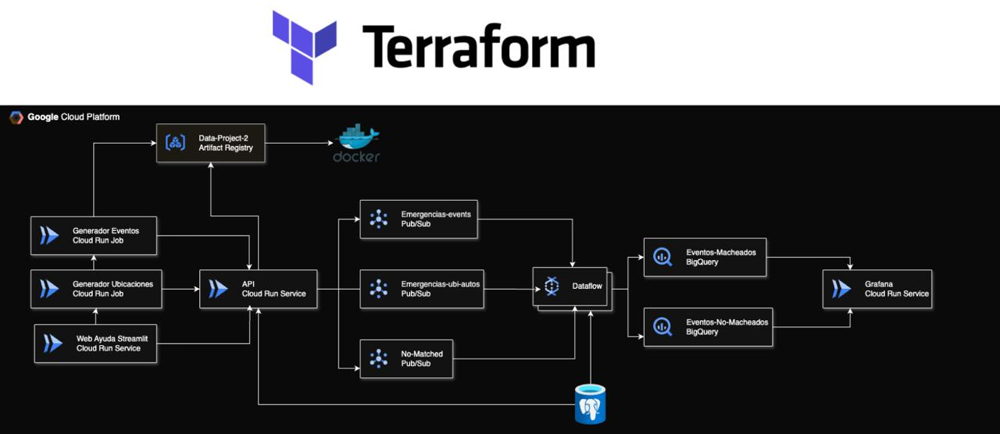

# Data-Project-2

# 🚨 Proyecto de Asistencia de Emergencias  Valencia

## 📝 Descripción General

Este proyecto tiene como finalidad crear una plataforma tecnológica para gestionar solicitudes de emergencia ciudadana en el contexto de la DANA en Valencia. Inspirado en el modelo del *112, permite a los ciudadanos reportar situaciones urgentes a través de una aplicación sencilla construida con **Streamlit, mientras que el sistema se encarga de distribuir de forma inteligente los **recursos de emergencia disponibles* (bomberos, ambulancias, y policías).

La plataforma utiliza la infraestructura de *Google Cloud Platform* para procesar los datos en tiempo real, emparejar solicitudes con recursos adecuados y almacenar toda la información.

El sistema prioriza las solicitudes más críticas y asigna los recursos más cercanos, teniendo en cuenta su disponibilidad.

---

## ⚙️ Funcionalidades Principales

•⁠  ⁠*📨 Registro de Incidencias*: Formulario para que los ciudadanos reporten situaciones de emergencia.

•⁠  ⁠*🔁 Asignación Inteligente de Recursos*: El sistema distribuye recursos (ambulancias, bomberos, policías) según urgencia, ubicación y disponibilidad.

•⁠  ⁠*📍 Criterio de emparejamiento*: Calculamos un coeficiente haciendo una mezcla entre la urgencia de la emergencia y su proximidad

•⁠  ⁠*⚡ Procesamiento en Tiempo Real*: Pipeline con Apache Beam desplegado en Dataflow.

•⁠  ⁠*📊 Almacenamiento y Visualización*: Registro y análisis de datos en BigQuery y dashboards en Grafana.

•⁠  ⁠*🛠️ Despliegue Automatizado*: Toda la infraestructura está definida como código con Terraform.

---

## 🏗️ Arquitectura del Proyecto

## 🔄 Flujo de Datos

1.⁠ ⁠Un ciudadano reporta una emergencia a través de un formulario en Streamlit.
2.⁠ ⁠La información se publica en *Pub/Sub* en un canal específico para emergencias.
3.⁠ ⁠Un job de *Apache Beam* en *Dataflow* procesa los eventos:
   - Clasifica los reportes por tipo de emergencia.
   - Evalúa el nivel de urgencia.
   - Busca recursos (ambulancias, bomberos o policías) disponibles y próximos.
   - Asigna el recurso más adecuado mediante el criterio e asignacion.
   - Si no hay disponibilidad, el evento se inserta en un topic (No-Mached) para que se reintente.
   - Finalmente, se registran los resultados en BigQuery tanto los resultados macheados como los no macheados.

*Tablas en BigQuery:*
•⁠  ⁠⁠ emergencias-macheadas ⁠: Emergencias asignadas correctamente.
•⁠  ⁠⁠ emergencias-no-macheadas ⁠: Emergencias no asignadas por falta de recursos.

*Grafana* se conecta a estas tablas para ofrecer una visión operativa en tiempo real.

---

## 🧠 Criterio de Asignación

El sistema de asignación funciona con base en los siguientes pasos:

1.⁠ ⁠Se ordenan las solicitudes según su nivel de urgencia (de mayor a menor).
2.⁠ ⁠Para cada solicitud, se localiza el recurso libre más cercano dentro de su zona de cobertura.
3.⁠ ⁠Se crea una asignación y el recurso queda marcado como ocupado para evitar duplicidades.
4.⁠ ⁠Las solicitudes sin recursos disponibles se almacenan en el topic para su posterior reintento.

---

## 🔧 Requisitos Técnicos

•⁠  ⁠Python 
•⁠  ⁠Cuenta en Google Cloud 
•⁠  ⁠Google Cloud SDK
•⁠  ⁠Terraform como IAAC

---

Este sistema está diseñado para mejorar la eficiencia y rapidez en la gestión de emergencias durante eventos catastróficos como la DANA, ayudando a priorizar vidas y recursos cuando más se necesitan.

## VIDEO DEMO
https://youtu.be/RijW_lruL7w