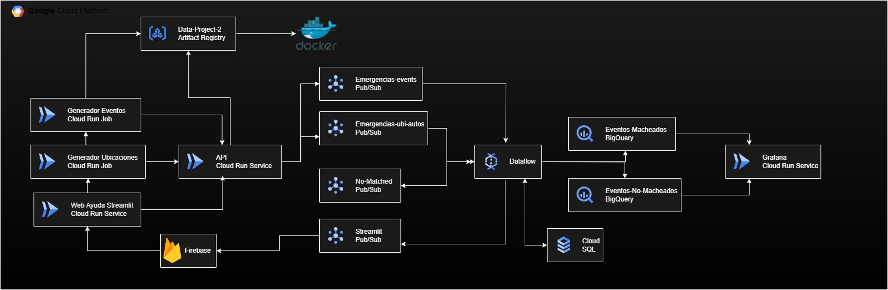

# 🚨 Simulador del 112 de Emergencias – Proyecto Cloud

## 📝 Descripción General

Este proyecto emula el funcionamiento de un sistema de emergencias **112**, desde la recepción de incidentes hasta la asignación de recursos de respuesta (policía, bomberos, ambulancias), todo desplegado sobre **Google Cloud Platform (GCP)**.

El sistema incluye generación de emergencias simuladas, localización de vehículos, asignación inteligente en tiempo real y visualización analítica de resultados. Todo orquestado con **servicios gestionados**, automatizado mediante **Terraform**.

---

## 🧩 Componentes Principales

### 🌐 Web de Emergencias (Streamlit)
- Interfaz donde el usuario puede introducir manualmente emergencias.
- Conectada a una **API centralizada** que se encarga del procesamiento.

### ⚙️ Simuladores
- **Generador de Emergencias**: Envía emergencias ficticias al sistema.
- **Generador de Vehículos**: Simula vehículos disponibles con su ubicación.
- Ambos están desplegados en **Cloud Run** como servicios o jobs.

### 🚪 API Centralizada (FastAPI)
- Punto de entrada para las emergencias (web o generador).
- Publica los datos en dos **topics de Pub/Sub**:
  - Emergencias
  - Vehículos
- Consulta una base de datos **PostgreSQL (Cloud SQL)** para conocer el estado de los recursos.
- Usa **Service Accounts** con permisos mínimos para mayor seguridad.

### 🔄 Procesamiento con Dataflow (Apache Beam)
- Consume en tiempo real los mensajes de los topics.
- Agrupa emergencias y vehículos por tipo de servicio:
  - 🚓 Policía
  - 🚑 Ambulancias
  - 🚒 Bomberos
- Calcula coeficientes de prioridad basados en:
  - Nivel de emergencia
  - Distancia al vehículo
- Asigna vehículos óptimos y gestiona resultados:
  - ✅ **BigQuery**: almacenamiento de asignaciones y emergencias
  - ✅ **Cloud SQL**: actualiza estado y ubicación de los recursos
  - 🔁 **Pub/Sub**: reenvía emergencias no asignadas para reintento
  - 📩 **Pub/Sub**: simula notificación al usuario vía Firebase

### 🗃️ Base de Datos (PostgreSQL en Cloud SQL)
- Guarda información de cada vehículo:
  - Ubicación
  - Estado (`asignado = True / False`)
- Se actualiza con cada asignación o liberación desde Dataflow.

### 📊 Análisis en Tiempo Real (BigQuery + Grafana)
- Emergencias y asignaciones quedan registradas en BigQuery.
- **Grafana**, desplegado en **Cloud Run**, se conecta a BigQuery para mostrar dashboards en tiempo real.

### 🔔 Firebase (Simulación)
- Se plantea el uso de Firebase para notificar al usuario qué recurso ha sido asignado.
- Aunque no se ha implementado (por limitaciones de cuenta), se **simula** con una Cloud Function que imprime el mensaje recibido por Pub/Sub.

---

## 🏗️ Arquitectura General

A continuación se muestra un diagrama general del flujo del sistema:

  

---

## 🎥 Demo del Proyecto

Puedes ver el funcionamiento completo del sistema en el siguiente video:

📺 [Ver Demo en YouTube](https://www.youtube.com/watch?v=RijW_lruL7w)

---

## 🛠️ Infraestructura como Código (Terraform)

Todo el sistema está automatizado con **Terraform**, dividido en módulos independientes:
- ArtifactRegistry
- BigQuery
- CloudApi
- CloudFunction
- CloudJobGeneradorApp
- CloudRunJobGeneradorUbi
- CloudRunGrafana
- CloudSQL
- CloudStreamlit
- Pub/Sub

Cada carpeta configura su propio recurso y **Service Account**, siguiendo el principio de **mínimos privilegios**.

Este sistema está diseñado para mejorar la eficiencia y rapidez en la gestión de emergencias durante eventos catastróficos como la DANA, ayudando a priorizar vidas y recursos cuando más se necesitan.

## VIDEO DEMO
https://youtu.be/RijW_lruL7w
