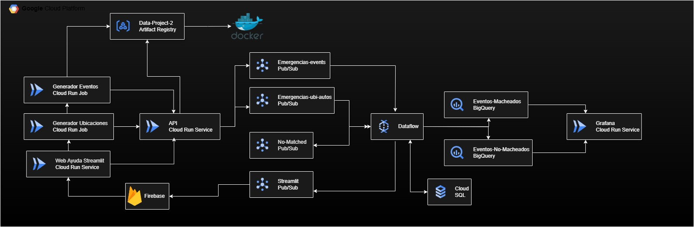

# 🚨 Emergency 112 Simulator – Cloud Project

## 📝 General Overview

This project simulates the operations of an **Emergency 112 system**, from incident intake to intelligent resource dispatching (police, firefighters, ambulances), all deployed on **Google Cloud Platform (GCP)**.

The system includes simulated emergency generation, real-time vehicle location updates, intelligent assignment, and analytics visualization. Everything is orchestrated using **managed cloud services** and automated with **Terraform**.

---

## 🧩 Main Components

### 🌐 Emergency Web Interface (Streamlit)
- A user-friendly interface for manually reporting emergencies.
- Connected to a **centralized API** responsible for processing input data.

### ⚙️ Simulators
- **Emergency Generator**: Sends simulated emergency events to the system.
- **Vehicle Generator**: Simulates available vehicles and their locations.
- Both are deployed on **Cloud Run** as services or jobs.

### 🚪 Centralized API (FastAPI)
- Main entry point for emergency data (from web or simulators).
- Publishes data to two **Pub/Sub topics**:
  - Emergencies
  - Vehicles
- Queries a **PostgreSQL (Cloud SQL)** database to retrieve vehicle status.
- Uses **Service Accounts** with minimal privileges for secure access.

### 🔄 Real-Time Processing with Dataflow (Apache Beam)
- Consumes messages from Pub/Sub in real time.
- Groups emergencies and vehicles by service type:
  - 🚓 Police
  - 🚑 Ambulances
  - 🚒 Firefighters
- Calculates a priority score based on:
  - Emergency severity
  - Distance to available vehicles
- Handles assignment and output:
  - ✅ **BigQuery**: stores assignments and emergency records
  - ✅ **Cloud SQL**: updates vehicle location and status
  - 🔁 **Pub/Sub**: re-publishes unassigned emergencies for reattempt
  - 📩 **Pub/Sub**: simulates user notification via Firebase

### 🗃️ Database (PostgreSQL in Cloud SQL)
- Stores each vehicle’s:
  - Location
  - Status (`assigned = True / False`)
- Updated by Dataflow after assignment or release.

### 📊 Real-Time Analytics (BigQuery + Grafana)
- Emergency and assignment data is logged in BigQuery.
- **Grafana**, deployed on **Cloud Run**, connects to BigQuery to display real-time dashboards.

### 🔔 Firebase (Simulation)
- Firebase is proposed for notifying users when a vehicle is assigned.
- Although not implemented (due to account limitations), it’s **simulated** with a Cloud Function that prints messages received from Pub/Sub.

---

## 🏗️ System Architecture

The diagram below outlines the general system flow:

---

## 🎥 Project Demo

Watch the full demo of the system here:

📺 [Watch Demo on YouTube](https://www.youtube.com/watch?v=RijW_lruL7w)

---

## 🛠️ Infrastructure as Code (Terraform)

The entire system is deployed using **Terraform**, organized into independent modules:
- ArtifactRegistry  
- BigQuery  
- CloudApi  
- CloudFunction  
- CloudJobGeneradorApp  
- CloudRunJobGeneradorUbi  
- CloudRunGrafana  
- CloudSQL  
- CloudStreamlit  
- Pub/Sub  

Each folder configures its own resource and **Service Account**, following the principle of **least privilege**.

---